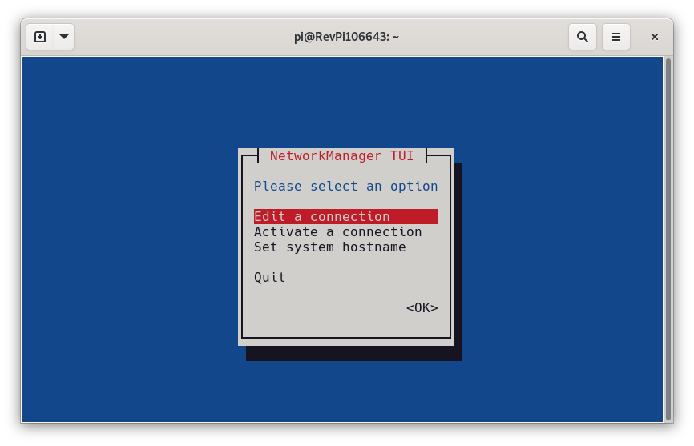
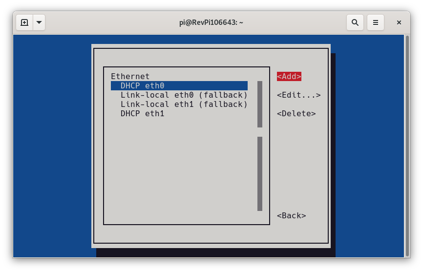
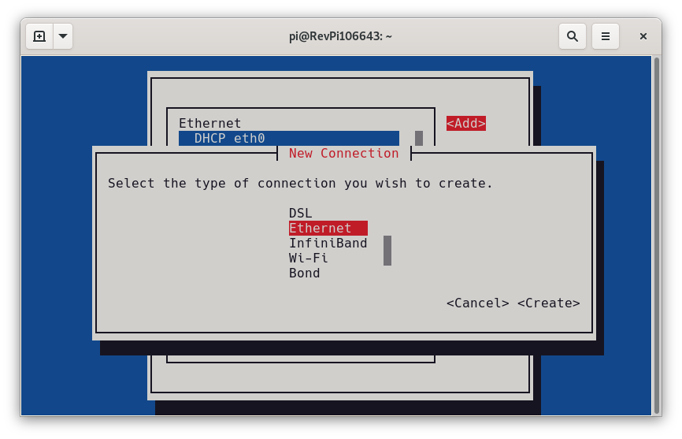
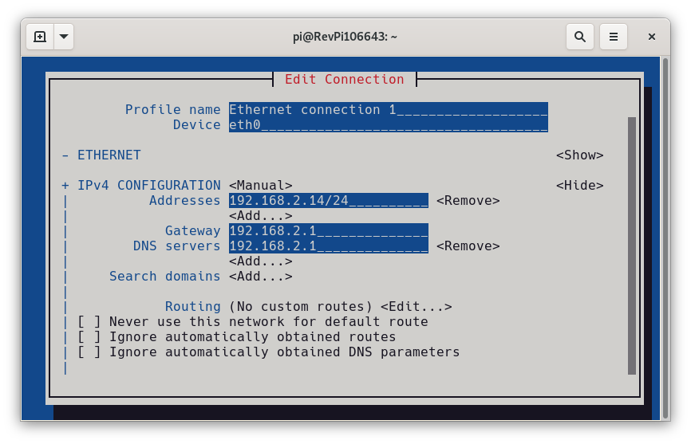

# Static IP with nmtui

## Step 1

Start `nmtui` as with root privileges:

```
sudo nmtui
```

Select entry `Edit a connection`:



## Step 2


Select button `Add`:



## Step 3

Select `Ethernet` as type:



## Step 4

Enter a name for the connection (eg. `Plant network`), choose a device (eg. `eth0` for the first interface) and select `Manual` as `IPv4 CONFIGURATION` mode. 

Enter IP address with prefix (eg `/24` for a `255.255.255.0` netmask) and fill in gateway and nameservers as necessary.



Save the configuration by selecting `OK`. Exting `nmtui` and reboot the RevPi.